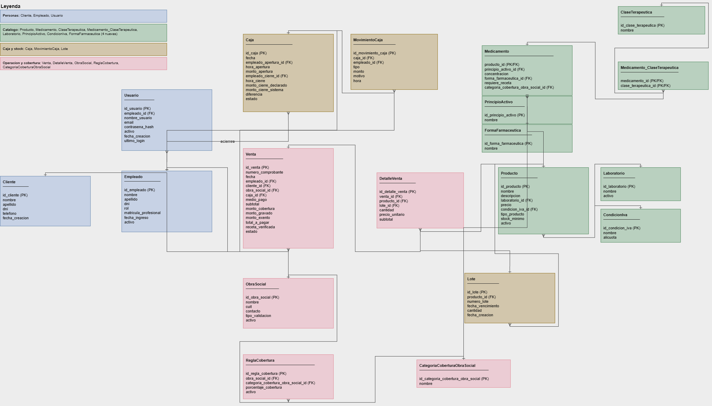

# Diseño de la Base de Datos: Decisiones y Justificaciones

## 1. Modelo relacional vs. modelo documental

Se optó por un modelo **relacional** en lugar de documental. El negocio centraliza operaciones que deben resolverse como una única unidad atómica: registrar una venta implica, al mismo tiempo, generar el detalle de productos vendidos, descontar stock del lote correspondiente y reflejar el movimiento en la caja del día. Si alguno de estos pasos fallara a mitad de camino, se generarían inconsistencias entre lo vendido, el stock disponible y el dinero registrado.

Un modelo relacional garantiza esta atomicidad de forma nativa mediante transacciones, e impone integridad referencial entre entidades fuertemente relacionadas (productos, lotes, obras sociales, reglas de cobertura, ventas y caja). A esto se suma que los datos del dominio tienen estructura homogénea y normalizada, y que buena parte de los requerimientos (reportes filtrables por producto, período y tipo de venta) se resuelven naturalmente con consultas que combinan varias tablas, un perfil de acceso para el que un modelo documental (pensado para estructuras variables por registro y acceso desnormalizado) no está optimizado.

## 2. Motor relacional: PostgreSQL

Se descartaron dos motores por no ajustarse a los requisitos del proyecto:

- **SQLite**: motor embebido de archivo único, pensado para una única aplicación local. La consigna académica exige backend y base de datos alojados en la nube, por lo que queda descartado (aunque sería la opción correcta en una eventual versión 100% local).
- **SQL Server**: sin una opción de despliegue gratuita y directa comparable a la infraestructura ya elegida (Supabase, Railway).

Entre **PostgreSQL** y **MySQL** (ambos con soporte gratuito y técnicamente equivalentes para este esquema) la decisión se apoyó en dos motivos concretos del proyecto:

1. **Infraestructura ya definida**: Supabase, una de las opciones de hosting elegidas, ofrece exclusivamente PostgreSQL.
2. **Extensibilidad futura**: una extensión planeada (un asistente basado en IA sobre el historial de ventas y stock) requiere búsqueda por similitud de embeddings, capacidad que PostgreSQL ofrece de forma nativa (extensión `pgvector`), y que en MySQL solo existe en su variante propietaria en la nube.

## Evolución del modelo de datos

El esquema actual no salió terminado desde el primer intento. Pasó por revisiones a medida que se lo confrontó con casos de uso reales del dominio. Estos son los cambios concretos entre la propuesta inicial de entidades y el modelo final:

- **Separación de `Producto` en `Producto` + `Medicamento`.** En una versión anterior del modelo, todos los productos (medicamentos, perfumería, cuidado personal) vivían en una única tabla `Producto` con todos los campos posibles. Al revisar casos concretos (¿qué concentración tiene un jabón? ¿qué principio activo tiene un termómetro?), quedó claro que varios atributos solo tenían sentido para medicamentos. Eso llevó a separar `Medicamento` como una especialización 1:1 de `Producto` (ver sección 4).
- **`CategoriaProducto` se redefinió como `CategoriaCoberturaObraSocial`.** La propuesta inicial tenía una tabla genérica `CategoriaProducto`, sin relación explícita con cobertura. Al avanzar en el diseño del motor de reglas de cobertura quedó claro que la única clasificación que el sistema necesita es específicamente la categoría del PMO (ambulatorio, crónico, oncológico, etc.), no una categoría de producto genérica, así que se renombró y se acotó su propósito a esa función puntual: ser el dato que se cruza con `ReglaCobertura` para calcular el copago.
- **Se agregaron `ClaseTerapeutica` y `Medicamento_ClaseTerapeutica`.** La propuesta inicial no distinguía clases terapéuticas (analgésico, antibiótico, etc.): no existían en el modelo original. Se incorporaron ambas al detectar que un medicamento puede pertenecer a más de una clase terapéutica a la vez, una relación N:M que se resuelve con la tabla asociativa `Medicamento_ClaseTerapeutica`.
- **Se eliminó la relación directa entre `Cliente` y `ObraSocial`.** En el modelo inicial, un cliente pertenecía a una obra social de forma fija (relación N:1 permanente sobre `Cliente`). Se descartó ese diseño porque la cobertura se define en el momento de cada venta, no como un atributo estable del cliente (un mismo cliente puede presentarse con o sin cobertura según la venta puntual). Por eso `obra_social_id` quedó en `Venta`, no en `Cliente`.
- **Eliminación de una entidad `MedioPago` independiente.** También se había considerado, en algún momento, modelar los medios de pago como una tabla de catálogo propia (siguiendo el mismo patrón que `CategoriaCoberturaObraSocial`). Se descartó porque no justificaba una tabla aparte, y quedó como una columna con valores fijos directamente en `Venta` (ver sección 12).
- **Se convirtieron `laboratorio`, `principio_activo`, `condicion_iva` y `forma_farmaceutica` de texto a tablas de catálogo.** A raíz de un comentario del tutor sobre varios atributos que vivían como texto libre en `Producto` y `Medicamento`, se revisó cada caso y se decidió pasarlos a tablas propias (`Laboratorio`, `PrincipioActivo`, `CondicionIva`, `FormaFarmaceutica`), evitando inconsistencias de escritura (ej. "Bagó" vs. "Laboratorios Bagó") y permitiendo actualizar un dato como la alícuota de IVA en un solo lugar. `tipo_producto`, `medio_pago` y `estado` se revisaron con el mismo criterio y se mantuvieron como texto con `CHECK`, por ser conjuntos de valores fijos y estables controlados por el sistema, no por el usuario (ver sección 19).

## 3. Entidades del modelo (19 tablas)

| Entidad | Rol |
|---|---|
| `Cliente` | Afiliado identificado en ventas con cobertura |
| `Producto` | Catálogo general (cualquier tipo de producto) |
| `Medicamento` | Especialización de `Producto` para ítems con acción farmacológica |
| `ClaseTerapeutica` | Categoría farmacológica (analgésico, antibiótico, etc.) |
| `Medicamento_ClaseTerapeutica` | Resuelve el N:M entre `Medicamento` y `ClaseTerapeutica` |
| `CategoriaCoberturaObraSocial` | Categorías de cobertura del PMO |
| `Lote` | Partidas de stock con vencimiento (FEFO) |
| `Empleado` | Legajo del personal |
| `Usuario` | Cuenta de acceso al sistema |
| `ObraSocial` | Entidades/mutuales/gremios con convenio |
| `ReglaCobertura` | Resuelve el N:M entre `ObraSocial` y `CategoriaCoberturaObraSocial` |
| `Caja` | Sesión de apertura/cierre diario |
| `MovimientoCaja` | Ingresos/retiros manuales dentro de una `Caja` |
| `Venta` | Cabecera de cada operación |
| `DetalleVenta` | Resuelve el N:M entre `Venta` y `Producto` |
| `Laboratorio` | Catálogo de fabricantes, referenciado desde `Producto` |
| `PrincipioActivo` | Catálogo de principios activos, referenciado desde `Medicamento` |
| `CondicionIva` | Catálogo de condiciones de IVA con su alícuota, referenciado desde `Producto` |
| `FormaFarmaceutica` | Catálogo de formas farmacéuticas, referenciado desde `Medicamento` |

## Justificación por entidad (síntesis)

| Entidad | Justificación |
|---|---|
| `Empleado` | Cada operación relevante (venta, apertura/cierre de caja, movimiento manual) debe quedar atribuida a un empleado puntual, con permisos distintos según su rol. Incluye `matricula_profesional` (opcional), dato real exigido solo a quien ejerce el rol de farmacéutico. |
| `Usuario` | Cuenta de acceso al sistema, separada de `Empleado` (ver secciones 10 y 11). |
| `Cliente` | Se modela aparte de `Empleado`/`Usuario` porque no opera el sistema: solo se referencia desde las ventas con cobertura. Es opcional porque la mayoría de las ventas (mostrador) no identifican comprador. Se mantiene como tabla con historial para poder consultar las compras de un mismo afiliado a lo largo del tiempo. |
| `Producto` | Entidad propia (no repetida dentro de `Lote` o `DetalleVenta`) porque sus atributos definitorios (nombre, precio, condición de IVA, tipo) son propiedades del catálogo que no cambian según la partida física ni la venta puntual. Sin esta separación, cada lote y cada línea de venta tendrían que repetir todos estos datos, con riesgo de inconsistencia. |
| `Medicamento` | Subtipo de `Producto` (relación 1:1), exclusivo para productos de tipo medicamento: concentra los atributos que solo tienen sentido para ellos (ver sección 4). |
| `ClaseTerapeutica` | Catálogo de clases farmacológicas, separado de `Medicamento` porque un medicamento puede pertenecer a más de una (ver sección 7). |
| `Medicamento_ClaseTerapeutica` | Entidad asociativa que resuelve el N:M entre `Medicamento` y `ClaseTerapeutica`, sin atributos propios (ver secciones 7 y 16). |
| `CategoriaCoberturaObraSocial` | Categoría de cobertura del PMO (ambulatorio, crónico, diabetes_insulina, oncológico, anticonceptivos, HIV, discapacidad). Se separa de `Producto` en tabla propia porque una misma categoría es compartida por múltiples productos, y es el dato que se cruza con `ReglaCobertura` para calcular el copago (ver sección 8). |
| `Lote` | Se separa de `Producto` porque un mismo producto tiene múltiples partidas con vencimientos distintos. Sin esta entidad no se puede implementar FEFO ni saber, ante una alerta de vencimiento, qué partida puntual está afectada. |
| `ObraSocial` | Catálogo de las entidades (obras sociales, mutuales, gremios) con las que la farmacia tiene un acuerdo de cobertura. |
| `ReglaCobertura` | Entidad asociativa entre `ObraSocial` y `CategoriaCoberturaObraSocial`. Carga el porcentaje de cobertura de esa combinación puntual (ver secciones 8 y 16). |
| `Caja` | Representa la sesión de apertura/cierre diario. Se modela como entidad propia y no como atributo de `Venta` porque cumple un rol distinto: es el "contenedor" que agrupa todas las ventas y movimientos manuales de una jornada, necesario para calcular el arqueo del día. |
| `MovimientoCaja` | Ingreso o retiro manual de dinero que no proviene de una venta (ver sección 13). |
| `Venta` | Cabecera de cada operación: agrupa quién la registró, a quién (si corresponde), bajo qué caja, con qué medio de pago, y los montos totales discriminados. Incorpora `receta_verificada` como confirmación de que el empleado controló la receta antes de aplicar el copago. |
| `DetalleVenta` | Entidad asociativa entre `Venta` y `Producto`: carga el lote exacto vendido y el precio unitario histórico (ver secciones 14 y 16). |
| `Laboratorio` | Catálogo de fabricantes. Evita que un mismo laboratorio se cargue de formas distintas al escribirlo a mano (ver sección 19). |
| `PrincipioActivo` | Catálogo de principios activos. Permite identificar qué medicamentos son alternativas entre sí (ver sección 19). |
| `CondicionIva` | Catálogo de condiciones de IVA, con su alícuota como dato propio de la tabla (ver sección 19). |
| `FormaFarmaceutica` | Catálogo de formas farmacéuticas (comprimido, jarabe, etc.), compartido entre medicamentos (ver sección 19). |

## Relación y cardinalidad

| Relación | Cardinalidad | Justificación |
|---|---|---|
| Empleado - Usuario | 1:0..1 (opcional) | Un empleado puede no tener usuario todavía; cada usuario pertenece a un único empleado. |
| Empleado - Caja | 1:N | Un empleado puede abrir/cerrar muchas cajas a lo largo del tiempo. |
| Empleado - Venta | 1:N | Responsabilidad individual: cada venta queda asociada a quien la registró. |
| Empleado - MovimientoCaja | 1:N | Cada movimiento manual de caja queda atribuido a un empleado. |
| Cliente - Venta | 1:N (opcional) | Un cliente puede tener muchas compras históricas; una venta puede no tener cliente (mostrador anónimo). |
| Producto - Lote | 1:N | Un producto puede tener múltiples lotes con vencimientos distintos. |
| Producto - DetalleVenta | 1:N | Un producto puede aparecer en muchas líneas de venta a lo largo del tiempo. |
| Producto - Medicamento | 1:0..1 | Un producto tiene una fila en Medicamento solo si su `tipo_producto` es `'medicamento'`; el resto de los productos no tiene fila ahí. |
| Medicamento - Medicamento_ClaseTerapeutica | 1:N | Un medicamento puede tener varias filas en la tabla puente (una por cada clase terapéutica que le corresponda). |
| ClaseTerapeutica - Medicamento_ClaseTerapeutica | 1:N | Una misma clase terapéutica agrupa a muchos medicamentos distintos, cada uno con su propia fila en la tabla puente. |
| Medicamento - CategoriaCoberturaObraSocial | N:1 (opcional) | Varios medicamentos comparten la misma categoría; un medicamento puede no tener ninguna asignada todavía. |
| Lote - DetalleVenta | 1:N | Cada línea de venta remite a un lote específico (FEFO). |
| ObraSocial - ReglaCobertura | 1:N | Una obra social define una regla por cada categoría de medicamento que decide cubrir. |
| CategoriaCoberturaObraSocial - ReglaCobertura | 1:N | Cada categoría puede tener una regla definida por cada obra social distinta. |
| ObraSocial - Venta | 1:N (opcional) | Una obra social cubre muchas ventas; una venta puede no tener cobertura. |
| Caja - Venta | 1:N | Todas las ventas de una jornada quedan asociadas a la caja abierta en ese momento. |
| Caja - MovimientoCaja | 1:N | Los movimientos manuales del día quedan agrupados bajo la caja de esa jornada. |
| Venta - DetalleVenta | 1:N | Una venta tiene una o más líneas de producto; una línea no existe sin su venta (dependencia fuerte). |
| Laboratorio - Producto | 1:N | Un laboratorio tiene muchos productos. Es obligatorio en los medicamentos y opcional en el resto. |
| PrincipioActivo - Medicamento | 1:N | Un principio activo agrupa muchos medicamentos (distintas marcas). Cada medicamento tiene uno. |
| CondicionIva - Producto | 1:N | Todos los productos tienen una condición de IVA. |
| FormaFarmaceutica - Medicamento | 1:N | Una forma agrupa muchos medicamentos. |

## Diagrama Entidad-Relación (DER)

## 4. Separación `Producto` / `Medicamento`

**Decisión:** modelar `Medicamento` como una especialización 1:1 de `Producto` (comparten la misma PK, `producto_id`), en vez de una única tabla `Producto` con todos los campos posibles, o tablas totalmente independientes por tipo de producto.

**Justificación:** los atributos definitorios de un producto (nombre, precio, condición de IVA) son propiedades de catálogo que aplican a cualquier tipo de producto por igual. En cambio, `concentracion`, `forma_farmaceutica`, `requiere_receta` y `principio_activo` no tienen ningún significado fuera del contexto de un medicamento: un termómetro o un jabón no tienen concentración ni requieren receta. Si estos campos vivieran en `Producto`, quedarían vacíos para la mayoría de los productos no-medicamento, y haría falta un `CHECK` por cada campo para restringir cuándo aplica. Al ser tabla aparte, la propia estructura garantiza que un producto no-medicamento simplemente no tenga fila en `Medicamento`.

El esquema completo (DDL) de ambas tablas está versionado en el repositorio (`database/03_producto.sql` y `database/07_medicamento.sql`); acá se documenta la decisión, no el código.

## 5. Ubicación del dato de fabricante (`laboratorio`)

**Decisión:** el campo `laboratorio` (fabricante) vive en `Producto`, no en `Medicamento`, aunque en la práctica sea un dato crítico principalmente para medicamentos.

**Alternativas consideradas y descartadas:**
- Agregar la columna en `Medicamento`: se descartó porque `Medicamento` comparte la misma fila física que `Producto` (relación 1:1), y duplicar el dato en las dos tablas generaría riesgo de desincronización si se actualiza en una y no en la otra.
- Llamarlo `marca`: se descartó porque el nombre comercial ya queda contenido dentro de `Producto.nombre` (ej. 'Ibuprofeno 400mg Bagó'). Un campo `marca` aparte sería, en la mayoría de los casos, repetir el mismo dato dos veces.

**Regla general aplicada:** un atributo va en la tabla general (`Producto`) si la pregunta que responde tiene sentido para cualquier tipo de producto, aunque en algunos casos importe menos (ej. '¿quién fabricó este termómetro?' es una pregunta válida, solo que nadie la prioriza). Un atributo va en la tabla especializada (`Medicamento`) si la pregunta no se puede formular fuera de ese contexto (ej. '¿cuál es la vía de administración de este jabón?' no tiene sentido).

Como `laboratorio` aplica siempre pero es más importante para medicamentos, se resolvió con una restricción `CHECK` condicional en `Producto` en vez de mover la columna de tabla: el campo puede quedar vacío en general, pero la base exige que esté cargado cuando `tipo_producto` es `'medicamento'`.

**Actualización:** esta decisión fue revertida, ver sección 19.

## 6. Incorporación de `principio_activo` a `Medicamento`

**Decisión:** agregar la columna `principio_activo` (NOT NULL) a `Medicamento`, ausente en una versión anterior del diseño.

**Justificación:** la Ley de Prescripción por Nombre Genérico obliga a que las recetas se emitan por el nombre del principio activo, no por la marca comercial, permitiendo al paciente elegir entre las alternativas comerciales disponibles. Sin este campo, el sistema no podía responder la pregunta '¿qué otros productos son intercambiables con este, por tener el mismo principio activo de distintos laboratorios?', que es exactamente el caso de uso que la ley exige poder resolver en el mostrador.

A diferencia de `laboratorio`, no requiere `CHECK` condicional: todo medicamento, por definición, tiene un principio activo, así que es `NOT NULL` sin excepciones.

**Actualización:** esta decisión fue revertida, ver sección 19.

## 7. `ClaseTerapeutica` y la relación N:M con `Medicamento`

**Decisión:** `ClaseTerapeutica` es una tabla de catálogo aparte (no una columna de texto libre en `Medicamento`), vinculada mediante la tabla asociativa `Medicamento_ClaseTerapeutica`.

**Justificación:**
- Un medicamento puede pertenecer a más de una clase terapéutica a la vez (ej. un antigripal puede ser analgésico y antihistamínico simultáneamente), y una columna simple en `Medicamento` no puede guardar dos valores a la vez.
- Al ser tabla de catálogo en vez de texto libre repetido, el nombre de la clase se escribe una sola vez y se referencia, evitando inconsistencias de escritura entre registros (con o sin tilde, mayúscula inicial, etc.).

`Medicamento_ClaseTerapeutica` es la entidad asociativa más simple del modelo: solo lleva las dos claves foráneas, sin ningún atributo propio, porque la relación en sí no tiene ningún dato que le pertenezca únicamente a esa combinación puntual.

## 8. Categorías de cobertura del PMO y `ReglaCobertura`

**Decisión:** `CategoriaCoberturaObraSocial` es una tabla de catálogo (no un `CHECK` con valores hardcodeados), y la relación N:M con `ObraSocial` se resuelve con la tabla asociativa `ReglaCobertura`.

**Justificación:**
- `CategoriaCoberturaObraSocial` se referencia desde dos tablas (`Medicamento` y `ReglaCobertura`) que necesitan estar sincronizadas en los mismos valores. Si fuera un `CHECK` en cada tabla, agregar una categoría nueva del PMO obligaría a modificar dos restricciones a la vez; como tabla, es una fila más.
- `ReglaCobertura` existe porque una misma obra social cubre varias categorías con distinto porcentaje cada una, y una misma categoría es cubierta de forma distinta según la obra social. El dato `porcentaje_cobertura` no pertenece ni a la obra social ni a la categoría por separado, sino específicamente a esa combinación, y es la razón por la que se necesita una entidad asociativa con atributo propio, y no alcanza con una relación directa.

## 9. `tipo_validacion` en `ObraSocial`

**Decisión:** agregar la columna `tipo_validacion` ('manual' | 'externa', DEFAULT 'manual') a `ObraSocial`.

**Justificación:** el diseño ya contemplaba, a nivel de arquitectura de software, que el cálculo de cobertura se construye detrás de una interfaz (patrón Strategy) para poder convivir a futuro con validadores externos reales, sin rediseñar el sistema. `tipo_validacion` es el gancho concreto de esa extensibilidad a nivel de base de datos: permite que, en el futuro, una obra social puntual se marque como resuelta por un validador externo en vez de manualmente, sin cambiar la estructura de la tabla. El valor por defecto es 'manual' porque, en el alcance actual del TFI, ninguna obra social tiene un validador externo implementado.

## 10. Separación `Empleado` / `Usuario`

**Decisión:** `Empleado` (legajo) y `Usuario` (cuenta de acceso) son dos tablas distintas, con una relación 1:1 opcional de un solo lado (`Usuario.empleado_id` es UNIQUE NOT NULL).

**Justificación:** un empleado puede existir (estar contratado, con rol asignado) antes de que se le dé de alta el usuario de acceso al sistema (por ejemplo, el día que ingresa a trabajar puede no coincidir con el día que se le crea la cuenta). Modelarlos juntos obligaría a que todo empleado tuviera credenciales de acceso desde el momento del alta, lo cual no refleja el proceso real de incorporación de personal.

Cardinalidad resultante: todo `Usuario` está asociado a un único `Empleado` (obligatorio), pero no todo `Empleado` tiene necesariamente un `Usuario` (opcional). El UNIQUE en `empleado_id` además garantiza que un mismo empleado no pueda tener dos cuentas de acceso distintas.

## 11. Ubicación del campo `email`

**Decisión:** `email` vive en `Usuario`, no en `Empleado`.

**Justificación:** el `email` en este sistema cumple una función de dato de cuenta (login, recuperación de contraseña), no de dato de contacto general de la persona: es un concepto de la misma familia que `nombre_usuario` y `contrasena_hash`, que ya viven en `Usuario`. Ponerlo en `Empleado` como NOT NULL obligaría a cargar un email en el momento de dar de alta el legajo, incluso cuando todavía no se decidió si esa persona va a tener acceso al sistema, rompiendo la misma separación legajo/acceso que justifica tener `Usuario` como tabla aparte.

## 12. Por qué no existe una entidad `MedioPago`

**Decisión:** el medio de pago se modela como el campo `medio_pago` (VARCHAR con valores fijos: 'efectivo', 'tarjeta_credito', 'tarjeta_debito', 'transferencia', 'qr') directamente en `Venta`, sin una tabla de catálogo separada.

**Justificación:** es el mismo criterio aplicado a `tipo_producto`, `rol` y `estado`: se trata de un conjunto de valores fijo, pequeño y estable, referenciado desde una única tabla (`Venta`). (Ver sección 19 sobre por qué `condicion_iva`, que antes seguía este mismo criterio, pasó a ser una tabla de catálogo). No existe la necesidad de sincronización entre múltiples tablas que sí justifica una tabla de catálogo aparte, como es el caso de `CategoriaCoberturaObraSocial` (referenciada desde `Medicamento` y `ReglaCobertura`). Agregar una tabla `MedioPago` para cinco valores que no cambian con frecuencia habría sumado una FK y un JOIN adicional en cada consulta de ventas, sin ningún beneficio real de mantenimiento.

## 13. `Caja` y `MovimientoCaja`

**Decisión:** `Caja` representa la sesión de apertura/cierre diario, con dos claves foráneas distintas hacia `Empleado` (`empleado_apertura_id`, `empleado_cierre_id`); `MovimientoCaja` es una tabla aparte para los ingresos/retiros manuales.

**Justificación:**
- Dos FK a `Empleado`: el empleado que abre la caja a la mañana muy probablemente no sea el mismo que la cierra a la noche, por lo que se mantiene la trazabilidad de ambos eventos por separado.
- `monto_cierre_declarado` vs. `monto_cierre_sistema` están separados porque es el dato central que resuelve el problema de negocio de errores de cálculo en diferencias de caja: el segundo es lo que el sistema calculó automáticamente sumando ventas y movimientos manuales; el primero es lo que el empleado cuenta físicamente. La columna `diferencia` es la resta entre ambos.
- `MovimientoCaja` es tabla aparte de `Caja` porque son eventos discretos que pueden ocurrir varias veces dentro de una misma jornada (no es un dato de la caja, sino potencialmente muchos registros independientes), y son conceptualmente distintos de las ventas, que ya tienen su propio medio de pago y su propia lógica.

## 14. `Venta` como entidad central y `DetalleVenta`

**Decisión:** `Venta` concentra las referencias a `Empleado`, `Cliente` (opcional), `ObraSocial` (opcional) y `Caja`; `DetalleVenta` resuelve el N:M entre `Venta` y `Producto`, cargando `lote_id` y `precio_unitario` como atributos propios.

**Justificación:**
- `cliente_id` y `obra_social_id` son NULLABLE por separado, pero con una dependencia cruzada reforzada con una restricción `CHECK` sobre ambos campos a la vez: la mayoría de las ventas de mostrador no identifican comprador, pero si hay obra social asociada, el cliente deja de ser opcional (no puede haber cobertura sin afiliado identificado). No alcanzaba con dejar cada campo opcional por separado, porque eso no impedía cargar una obra social sin cliente.
- `precio_unitario` en `DetalleVenta` no se lee de `Producto.precio` porque el precio de catálogo cambia con el tiempo; el comprobante de venta tiene que preservar el valor histórico realmente cobrado ese día.
- `lote_id` es NOT NULL (no opcional) porque cada línea de venta necesita saber de qué partida física salió el producto, para la trazabilidad FEFO y para poder responder ante una eventual alerta de retiro de mercado.

## 15. `Lote`: por qué depende de `Producto` y no de `Medicamento`

**Decisión:** la FK `producto_id` en `Lote` apunta a `Producto`, no a `Medicamento`.

**Justificación:** la trazabilidad de stock por vencimiento (FEFO) aplica a cualquier tipo de producto, no solo a medicamentos: un jabón o un termómetro también tienen lotes y, potencialmente, fecha de vencimiento o control de partidas. Atar `Lote` a `Medicamento` excluiría injustificadamente al resto del catálogo de la gestión de stock.

## 16. Resumen: entidades asociativas (relaciones N:M)

El modelo tiene tres relaciones N:M reales del dominio, cada una resuelta con su propia entidad asociativa:

| Entidad asociativa | Resuelve | Atributo propio |
|---|---|---|
| `DetalleVenta` | `Venta` <-> `Producto` | `lote_id`, `precio_unitario` |
| `ReglaCobertura` | `ObraSocial` <-> `CategoriaCoberturaObraSocial` | `porcentaje_cobertura` |
| `Medicamento_ClaseTerapeutica` | `Medicamento` <-> `ClaseTerapeutica` | ninguno (solo las dos FK) |

Las tres comparten el mismo patrón: una tabla que lleva las claves foráneas de ambos lados, más los datos propios de esa combinación puntual que no pertenecen a ninguna de las dos entidades por separado.

## 17. Política de integridad referencial (ON DELETE)

**Decisión:** la mayoría de las claves foráneas usan el comportamiento por defecto de PostgreSQL (`NO ACTION`, que impide borrar un registro padre mientras tenga hijos, igual que `RESTRICT`). Hay tres excepciones, con `ON DELETE CASCADE`: `detalle_venta -> venta`, `medicamento -> producto` y `medicamento_clase_terapeutica -> medicamento`.

**Justificación:** no se puede borrar un producto, un empleado o una obra social que ya tiene historial asociado (ventas, lotes, reglas de cobertura). En su lugar, se dan de baja de forma lógica con el campo `activo`, preservando ese historial para auditoría y reportes.

Las tres excepciones son tablas cuyas filas no tienen sentido de existir sin su padre:

- `detalle_venta -> venta`: una línea de detalle no existe sin su venta cabecera.
- `medicamento -> producto`: `Medicamento` es una especialización 1:1 que comparte la clave de `Producto` y solo extiende sus datos; si se elimina el producto, su fila de medicamento no puede quedar sola.
- `medicamento_clase_terapeutica -> medicamento`: el vínculo con una clase terapéutica no existe sin el medicamento al que pertenece.

En ningún caso se propaga a un historial (lotes, ventas, reglas de cobertura), porque esas relaciones no usan `CASCADE`. Además, en la práctica el `CASCADE` casi no se usa: las ventas no se eliminan sino que se anulan cambiando su `estado` a 'anulada', y los productos se dan de baja con `activo`. Queda como una protección de consistencia (por ejemplo, ante un producto cargado por error que todavía no tiene lotes ni ventas), no como un camino operativo habitual del sistema.

**Actualización:** además, se agregó `ON DELETE RESTRICT` explícito en la FK `clase_terapeutica_id` de `medicamento_clase_terapeutica` (antes usaba el default sin declararlo). El comportamiento es el mismo (`NO ACTION` y `RESTRICT` actúan igual en PostgreSQL), pero queda documentado explícitamente en el DDL.

## 18. Proceso de validación del esquema

Durante la implementación de los scripts .sql, se revisó cada CREATE TABLE contra su justificación documentada, detectando y corrigiendo:

- Un error de sintaxis en `cliente` (paréntesis de apertura faltante).
- Una clave foránea mal referenciada en `regla_cobertura` (apuntaba a un nombre de columna que no coincidía con la PK real de `categoria_cobertura_obra_social`).
- Una inconsistencia de nombre entre la documentación y el DDL (`contrasena_hash` vs. `contraseña_hash` en `usuario`).
- La columna `tipo_validacion`, documentada en la tabla de atributos de `ObraSocial` pero ausente en el CREATE TABLE correspondiente.

Esta revisión se hizo tabla por tabla antes de subir cada script al repositorio, como parte del flujo de trabajo colaborativo entre los dos integrantes del equipo.

Como verificación final, se corrió el esquema completo contra una instancia real de PostgreSQL (`docker-compose down -v && docker-compose up --build`, forzando la recreación del volumen de datos), confirmando que las 19 tablas se crean correctamente en orden y sin errores de sintaxis ni de referencias entre sí.

## 19. Corrección del tutor: de atributos de texto a tablas de catálogo

**Decisión:** se revirtieron las decisiones de las secciones 5 y 6: `laboratorio` (en `Producto`) y `principio_activo` y `forma_farmaceutica` (en `Medicamento`) dejaron de ser columnas de texto libre y pasaron a ser claves foráneas hacia tablas de catálogo nuevas: `Laboratorio`, `PrincipioActivo` y `FormaFarmaceutica`. `condicion_iva` (en `Producto`), que ya era texto y se mencionaba en la sección 12 con el mismo criterio que `medio_pago`, tuvo el mismo tratamiento y pasó a `CondicionIva`.

**Motivo del cambio:** un comentario del tutor sobre el diseño señaló que varios atributos de texto libre correspondían, en realidad, a catálogos con entidad propia, y pidió que se revisara caso por caso si convenía dejarlos como texto con validación o convertirlos en tabla.

**Justificación por entidad:**

- **`Laboratorio`**: si se escribe a mano, un mismo laboratorio puede cargarse de formas distintas ('Bagó', 'Laboratorios Bagó'), y una búsqueda o reporte devolvería resultados incompletos. Como tabla, el nombre se registra una vez y, si cambia la razón social, se corrige en un solo lugar. Mantiene baja lógica con `activo`, por la misma razón que otras tablas con historial asociado.
- **`PrincipioActivo`**: es el dato que identifica qué productos son alternativas entre sí (mismo principio activo, distinto laboratorio). Con texto libre, 'Ibuprofeno' e 'ibuprofeno ' no coincidirían y esa búsqueda fallaría.
- **`CondicionIva`**: la alícuota (21%, 10,5%, exento) es un dato con valor propio que puede cambiar por normativa; como tabla, se actualiza en un lugar y no en cada producto. El nombre de la condición se guarda una sola vez y `Producto` la referencia por clave, no por valor repetido.
- **`FormaFarmaceutica`**: es un catálogo compartido (comprimido, jarabe, inyectable, crema, gotas, óvulo, supositorio, etc.) que puede crecer sin modificar la estructura de `Medicamento`, evitando variantes de escritura.

**Lo que se mantuvo como texto:** `tipo_producto`, `medio_pago` y `estado` se revisaron con el mismo criterio pero se mantuvieron como columnas de texto con `CHECK`, porque son conjuntos de valores fijos, pequeños y estables que decide el propio sistema (no el usuario cargando datos a mano), y no hay riesgo de inconsistencia de escritura en un valor que el código controla, a diferencia de un nombre de laboratorio o de principio activo que sí se tipea libremente.

Se aprovechó esta revisión para llevar al DDL dos validaciones que estaban documentadas pero no se habían implementado: el `CHECK` de `tipo_producto` en `producto` (con los valores `'medicamento'`, `'perfumeria'`, `'cuidado_personal'`, `'otro'`) y los `CHECK` de `medio_pago` y `estado` en `venta`.

El DDL de las cuatro tablas nuevas está en `database/00_laboratorio.sql`, `database/00_principio_activo.sql`, `database/00_condicion_iva.sql` y `database/00_forma_farmaceutica.sql`, y corren antes que `03_producto.sql` y `07_medicamento.sql` por el prefijo `00_`, ya que estos últimos ahora dependen de ellas por clave foránea.
